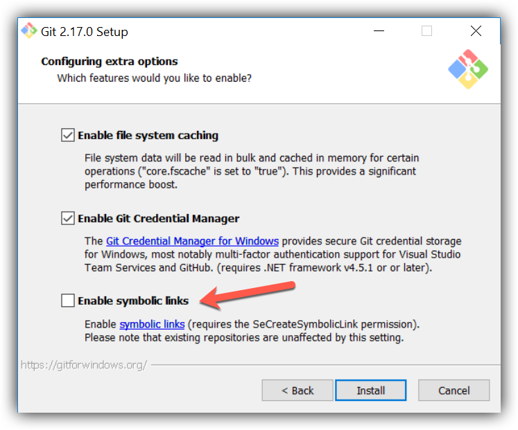

# Installation – Annotator (Windows)

## 1. Install Praat

Praat is the software we will use for creating the annotations. To install Praat, you
can download the `.zip` file from the
[website](https://www.fon.hum.uva.nl/praat/download_win.html).

## 2. Install Git

1. Download Git from the [website](https://git-scm.com/download/win) and run the
   executable.
2. Make sure you enable symbolic links when you install Git for Windows.
   <div style="text-align:left">
     
   </div>
3. To make symbolic links (symlinks) work, add `MSYS=winsymlinks:nativestrict` to the
   environmental variables.
   - Search for "Edit the system environment variables" in the Windows search bar and
     press Enter. The "System Properties" window will open.
   - Near the bottom of the window, click the "Environment Variables..." button.
   - Under the "System variables" pane, click the "New..." button.
   - In the "Variable name:" field, enter `MSYS` .
   - In the "Variable value:" field, enter `winsymlinks:nativestrict` .
   - Click "OK" on all the windows.

## 3. Clone Repository

Use the following commands to clone the repository.

**Note: the argument `-c core.symlinks=true` is crucial for pushing/pulling symlinks!**

```
git clone -c core.symlinks=true https://github.com/btamm12/fpack_webapp_client.git
git config --global core.autocrlf true
```

## 4. Installation: Core Components

### 4.1. Python

**4.1.1. Install Python**

1. Download Python version 3.9 (some packages don't have a 3.10 release as of
   26/11/2021) from the [website](https://www.python.org/downloads/) and run the
   [executable](https://www.python.org/ftp/python/3.9.10/python-3.9.10-amd64.exe).
2. You can check if Python 3.9 is installed by running the following command in the
   Command Prompt
   ```
   python --version
   ```
3. Enter the following command in the Command Prompt to search for the location where
   Python was installed.
   ```
   where python
   ```
4. Add `C:\path\to\python\Scripts` to the `PATH` environment variable. This will
   allow you to use Python's `pip` installer.
   - Search for "Edit the system environment variables" in the Windows search bar and
     press Enter. The "System Properties" window will open.
   - Near the bottom of the window, click the "Environment Variables..." button.
   - In the "System variables" pane, double click on the "Path" variable.
   - Click the "New" button and paste the path to the `Scripts` folder.
   - If the path to the Python folder itself (i.e. without `\Scripts`) is not in the
     list, add it as well using the "New" button.
   - Click "OK" on all of the windows.
   
**Note:** you will have to restart any terminals for this to take effect.

**4.1.2. Configure Avast (Optional)**

If you are using Avast Antivirus, then you will want to exclude the Python
executables from being scanned. Otherwise, Avast will waste a lot of time.

1. Open Avast Free Antivirus.
2. Navigate to "Menu" > "Settings" > "General" > "Exceptions".
3. Click on the "ADD EXCEPTION" button.
4. Enter the following path and click "ADD EXCEPTION".
   ```
   *\venv\Scripts\*
   ```

### 4.2. Windows Packages

**4.2.1. Microsoft C++ Runtime 14.0**

For some Python packages Microsoft C++ Runtime 14.0 is required.

- You can install this
by running [this executable](https://aka.ms/vs/17/release/vc_redist.x64.exe), which
can be found on the [Microsoft download
page](https://docs.microsoft.com/en-us/cpp/windows/latest-supported-vc-redist?view=msvc-170).

### 4.3. Install Other Core Components

Run the following command in Git Bash to
- create the symlink "create_venv.sh" in the root directory
- create the file "my_sections.txt" in the collaboration directory
- create the virtual environment "venv" in the root directory

```
cd install/windows
bash install_other_core.sh
```

