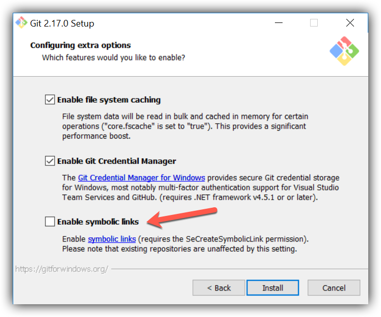

# Installation – Developer (Windows)

## 1. Install Praat

Praat is the software we will use for creating the annotations. To install Praat, you
can download the `.zip` file from the
[website](https://www.fon.hum.uva.nl/praat/download_win.html).

## 2. GitHub (First-Time Setup)

### 2.1 Install Git

1. Download Git from the [website](https://git-scm.com/download/win) and run the
   executable.
2. Make sure you enable symbolic links when you install Git for Windows.
   <div style="text-align:left">
     
   </div>
3. To make symbolic links (symlinks) work, add `MSYS=winsymlinks:nativestrict` to the
   environmental variables.
   - Search for "Edit the system environment variables" in the Windows search bar and
     press Enter. The "System Properties" window will open.
   - Near the bottom of the window, click the "Environment Variables..." button.
   - Under the "System variables" pane, click the "New..." button.
   - In the "Variable name:" field, enter `MSYS` .
   - In the "Variable value:" field, enter `winsymlinks:nativestrict` .
   - Click "OK" on all the windows.
   
   **How To Use:** to create a symlink, enter the following command in Git Bash.
   ```
   ln -s [TARGET] [LINK_NAME]
   ```

### 2.2. Register SSH Key
If you already have an SSH key registered in GitHub for your computer, you may skip
this step. If you don't, you need to follow this step in order to clone the
repository.

1. Open a web browser and navigate to https://github.com/settings/keys.
2. Click the "New SSH Key" button.
3. Check if you already have an SSH key on your computer. Open Git Bash and inspect
   the contents of your SSH folder.
   ```
   ls ~/.ssh/
   ```
   If the file `id_rsa.pub` appears in the list, then you already have an SSH key. In
   this case, **skip to step 5**. If it does not appear, or if you see a "No such
   file or directory" error, then continue with step 4.
4. Time to generate a new SSH key.
   - In Git Bash, run the following command.
     It is best to use the same email that you used to register for GitHub.
     ```
     ssh-keygen -t rsa -b 4096 -C "[YOUR.EMAIL@EXAMPLE.COM]"
     ```
   - The script will ask you to name the file. Leave this blank and press Enter.
   - The script will ask you to set a password. Leave this blank and press Enter.
   - The script will ask you to confirm your password. Leave this blank and press
     Enter.
5. Copy the contents of `~/.ssh/id_rsa.pub`
   ```
   cat ~/.ssh/id_rsa.pub | clip
   ```
   and paste it in the "Key" section of the
   webpage. Enter a title, e.g. "Lenovo-Laptop-Linux", and click the "Add SSH Key"
   button.

### 2.3. Configure Git Username/Email

Configure your username and email in order to push to GitHub. It is best to use the
same email that you used to register for GitHub. Open Git Bash and enter the
following commmands.
```
git config --global user.name "[username]"
git config --global user.email "[email]"
```

## 3. Clone Repository

Use the following commands to clone the repository.

**Note: the argument `-c core.symlinks=true` is crucial for pushing/pulling symlinks!**

```
git clone -c core.symlinks=true git@github.com:btamm12/fpack_webapp_client.git
git config --global core.autocrlf true
```

## 4. Installation: Core Components

### 4.1. Python

**4.1.1. Install Python**

1. Download Python version 3.9 (some packages don't have a 3.10 release as of
   26/11/2021) from the [website](https://www.python.org/downloads/) and run the
   executable.
2. You can check if Python 3.9 is installed by running the following command in the
   Command Prompt
   ```
   python --version
   ```
3. Enter the following command in the Command Prompt to search for the location where
   Python was installed.
   ```
   where python
   ```
4. Add `C:\path\to\python\Scripts` to the `PATH` environment variable. This will
   allow you to use Python's `pip` installer.
   - Search for "Edit the system environment variables" in the Windows search bar and
     press Enter. The "System Properties" window will open.
   - Near the bottom of the window, click the "Environment Variables..." button.
   - In the "System variables" pane, double click on the "Path" variable.
   - Click the "New" button and paste the path to the `Scripts` folder.
   - Click "OK" on all of the windows.
   
**Note:** you will have to restart any terminals (and VSCode) for this to take
effect.

**4.1.2. Configure Avast (Optional)**

If you are using Avast Antivirus, then you will want to exclude the Python
executables from being scanned. Otherwise, Avast will waste a lot of time.

1. Open Avast Free Antivirus.
2. Navigate to "Menu" > "Settings" > "General" > "Exceptions".
3. Click on the "ADD EXCEPTION" button.
4. Enter the following path and click "ADD EXCEPTION".
   ```
   *\venv\Scripts\*
   ```

### 4.2. Windows Packages

**4.2.1. Microsoft C++ Runtime 14.0**

For some Python packages Microsoft C++ Runtime 14.0 is required.

- You can install this
by running [this executable](https://aka.ms/vs/17/release/vc_redist.x64.exe), which
can be found on the [Microsoft download
page](https://docs.microsoft.com/en-us/cpp/windows/latest-supported-vc-redist?view=msvc-170).

### 4.3. Install Other Core Components

Run the following command in Git Bash to
- create the symlink "create_venv.sh" in the root directory
- create the file "my_sections.txt" in the collaboration directory
- create the virtual environment "venv" in the root directory

```
cd install/windows
bash install_other_core.sh
```


## 5. Installation: Development Components


### 5.1. Visual Studio Code

We recommend using Visual Studio Code for this project.

**5.1.1. Method 1: Normal Installation**

If you are on a personal computer with admin permissions, please download and
run the VSCode Windows installer, which can be found on the [VSCode
website](https://code.visualstudio.com/download).

**5.1.2. Method 2: Portable Installation**

If you do not have admin permissions, please download and extract the VSCode ZIP
file, which can be found on the [VSCode
website](https://code.visualstudio.com/download). The executable can be found in
the `bin/` folder.

### 5.2. Creating launch.json Symlink

Create the Windows launch.json symlink by running the following command.

```
cd install/windows/dev
bash create_launch_symlink.sh
```

### 5.3. Installing Recommended Extensions

Please install the recommended VSCode extensions by running the following
command in Git Bash.

```
cd install/windows/dev
bash install_extensions.sh
```
